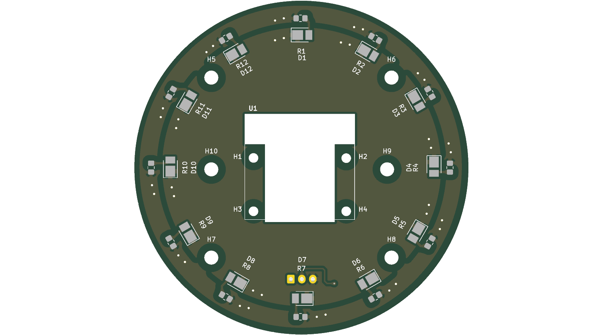
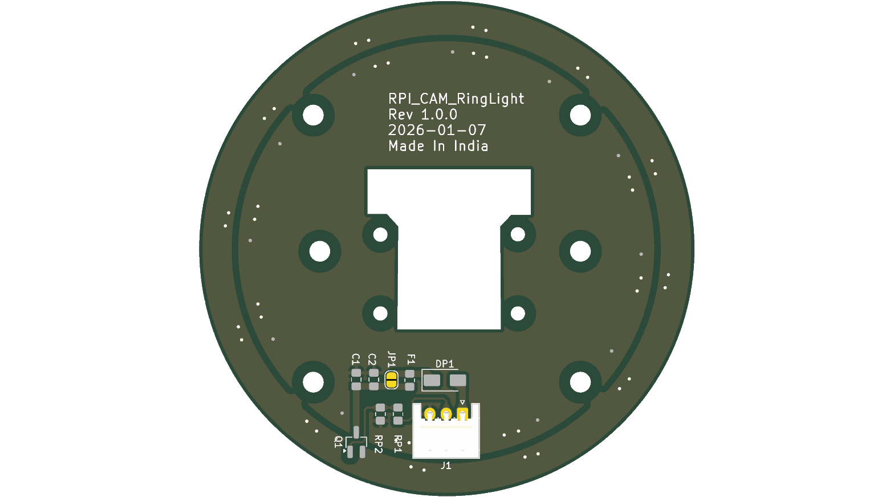
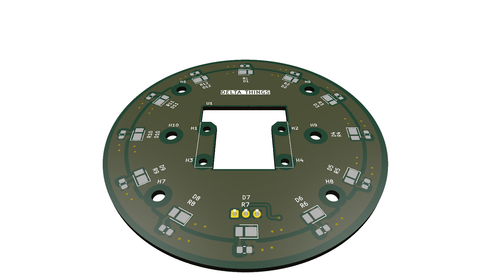

# RPI_Cam3_RL

## 🚀 How to Use Automation Script to generate fabrication outputs

### 🔧 Command Line (Terminal)

Run the following command **from the project directory** (where `.kicad_pro` file is located):

```bash
make
```
To generate zip of Gerbers for fabrication:
```bash
make release
```

Or run the script directly with Python:
```bash
python3 scripts/export_fab_outputs.py
```

### 3D view
#### Top View

#### Bottom View

#### Perspective View


### Schematic
[RPI_Cam3_RL_schematic.pdf](output/RPI_Cam3_RL_schematic.pdf)

### BOM
[RPI_Cam3_RL_BOM.xlsx](output/RPI_Cam3_RL_BOM.xlsx)

### Top Assembly
[RPI_Cam3_RL_Top_Assembly.pdf](output/RPI_Cam3_RL_Top_Assembly.pdf)

### Bottom Assembly
[RPI_Cam3_RL_Bottom_Assembly.pdf](output/RPI_Cam3_RL_Bottom_Assembly.pdf)

### Interactive BOM
Download and open [ibom.html](bom/ibom.html) in browser
